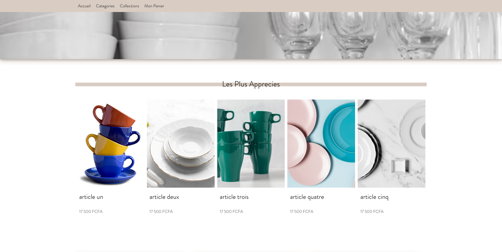
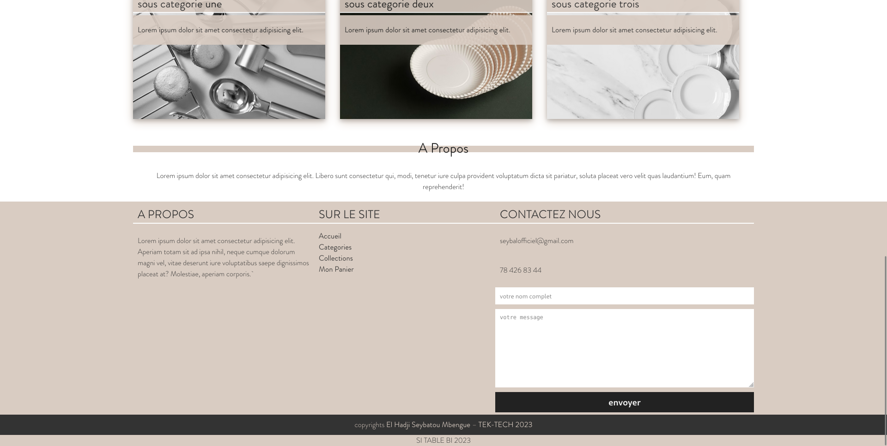
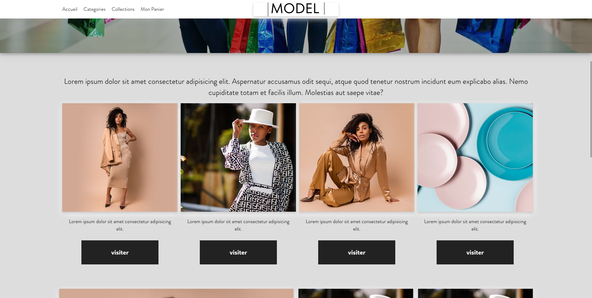
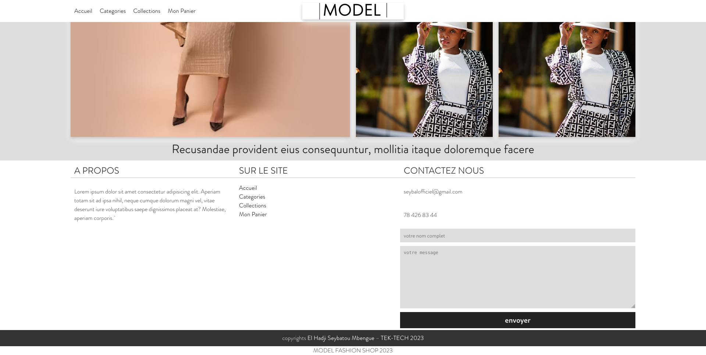
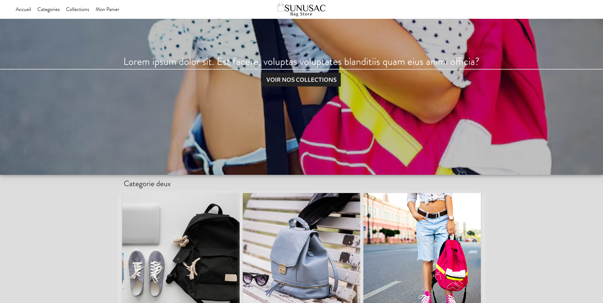
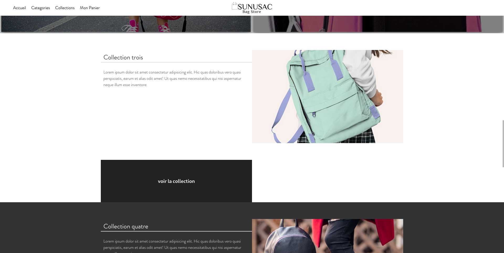

## BLOGHOME
> 

>    
>    
> 

> <a target='_blank' href='https://dev0ps221.github.io/landing_pages/bloghome'>VOIR LA DEMO</a>

## HOMESHOP
> 

>    
>    
> 

> <a target='_blank' href='https://dev0ps221.github.io/landing_pages/homeshop'>VOIR LA DEMO</a>

## SI TABLE BI
> 

>    
>    
> 

> <a target='_blank' href='https://dev0ps221.github.io/landing_pages/sitablebi'>VOIR LA DEMO</a>

## MODEL
> 

>    
>    
> 

> <a target='_blank' href='https://dev0ps221.github.io/landing_pages/model'>VOIR LA DEMO</a>

## SUNUSAC
> 

>    
>    
> 

> <a target='_blank' href='https://dev0ps221.github.io/landing_pages/sunusac'>VOIR LA DEMO</a>